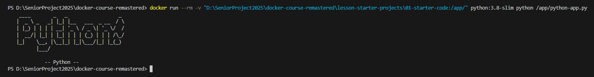
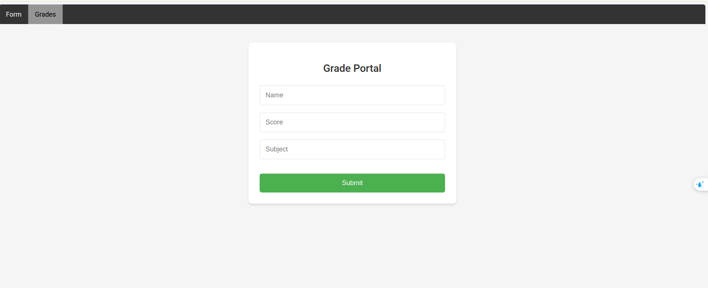

# Docker Training

## The need for Docker

- Docker là gì ?!
- Lí do cần Docker ?!
- Cài đặt Docker như thế nào ?!
- .....

## Chạy ứng dụng bên trong Docker Container

- Không quan trọng ngôn ngữ là gì, một khi chúng ta đã có hiểu biết về Docker, tất cả đều giống nhau.

### Chạy ứng dụng Python bên trong Docker Container

- Trong ví dụ đầu tiên, chúng ta sẽ thử chạy 1 ứng dụng Python đơn giản bên trong Docker Container.


- Hiện tại tôi muốn gắn thư mục python hiện tại vào thư mục `/app` bên trong Docker Container, và chạy ứng dụng Python này.

- Chúng ta sẽ sử dụng câu lệnh `docker run` sau đó chạy sử dụng cờ `-v` (viết tắt của `--volume`) để gắn thư mục hiện tại vào thư mục `/app` bên trong Docker Container.
- Bên trong docker container, để chúng ta có thể chạy ứng dụng Python, chúng ta cần phải cài đặt môi trường Python trước

- Chúng ta sẽ sử dụng 1 image có sẵn trên Hub đó là `python:3.8-slim` để chạy ứng dụng Python này.

- Giả sử chúng ta không biết gì về Python, làm gì để chúng ta có thể chạy ứng dụng Python này bên trong Docker Container?

``` text
# Developer: Hey there, Captain DevOps! To run this application without Docker, simply execute:
#            python python-app.py
#            I trust that you can take it from here and work your container magic. Smooth sailing!
```

```bash
docker run -v <local_path>:<container_path> <image_name>
```

```bash
docker run -v "D:\SeniorProject2025\docker-kube-tranning\docker-tranning\run-application-inside-docker-container\python:/app/" python:3.8-slim python /app/python-app.py
```

- Chúng ta sẽ sử dụng câu lệnh `docker run` để chạy ứng dụng Python này bên trong Docker Container.

- Lệnh này bằng lệnh `docker create` + `docker start`

- Chúng ta sẽ sử dụng cờ `-v` để gắn thư mục hiện tại vào thư mục `/app` bên trong Docker Container.
- Chúng ta sẽ sử dụng image `python:3.8-slim` để chạy ứng dụng Python này.
- Chúng ta sẽ sử dụng câu lệnh `python /app/python-app.py` để chạy ứng dụng Python này bên trong Docker Container. bên trong Docker Container.




- Bạn cũng có thể đặt tên cho container của mình bằng cách sử dụng cờ `--name` và thêm cờ `--rm` để tự động xóa container khi nó dừng lại.

```bash
docker run --name my-python-app --rm -v "D:\SeniorProject2025\docker-kube-tranning\docker-tranning\run-application-inside-docker-container\python:/app/" python:3.8-slim python /app/python-app.py
```

- Nên đặt tên cho container của bạn để dễ dàng quản lý và theo dõi.

- Xóa image bằng câu lệnh:

```bash
docker rmi python:3.8-slim
docker image rm python:3.8-slim
```

### Chạy ứng dụng Java bên trong Docker Container

- Trong ví dụ tiếp theo, chúng ta sẽ thử chạy 1 ứng dụng Java đơn giản bên trong Docker Container.


- Hướng dẫn:

```text
Developer: Greetings, Captain DevOps! This application is usually executed with the command:
           java -cp JavaApp.jar JavaApp
           However, I have full confidence in your abilities to containerize it and unleash its full potential. Fair winds and following seas!

```

```bash
docker run -v "D:\SeniorProject2025\docker-kube-tranning\docker-tranning\run-application-inside-docker-container\java:/app/" openjdk:11 java -cp /app/JavaApp.jar JavaApp
```

- Kết quả:


- Có thể dùng ChatGPT để convert các câu lệnh để chạy trên Windows sang Linux hoặc ngược lại.

### Chạy ứng dụng Ruby bên trong Docker Container

- Hướng dẫn:

```text
# Developer: Captain DevOps, this Ruby script generates a random inspirational quote and prints it along with an ASCII art border.
#            To run this script, you would typically use the command:
#            ruby script.rb
#            I trust you'll navigate the execution of this script within a Docker container with ease!
```

```bash
docker run -v "D:\SeniorProject2025\docker-kube-tranning\docker-tranning\run-application-inside-docker-container\ruby:/app/" ruby:3.0 ruby /app/script.rb
```

- Kết quả:


### Chạy ứng dụng Golang bên trong Docker Container

- Hướng dẫn:

```text
// Developer: Captain DevOps, this app expects an environment variable named "MESSAGE" to customize the greeting.
//            If "MESSAGE" is not set, it defaults to "Hello, World!".
//            To run the app, navigate to the directory containing main.go and execute: go run main.go
//            I trust you'll handle the environment setup and deployment with ease!


// PS:        Environment variables are key-value pairs that are typically set outside the application, and accessed inside the application.
```

```bash
docker run -e MESSAGE="Hello, Docker!" -v "D:\SeniorProject2025\docker-kube-tranning\docker-tranning\run-application-inside-docker-container\go:/app/" golang:1.20 go run /app/main.go
```

- Giải thích:
- Chúng ta sẽ sử dụng cờ `-e` để thiết lập biến môi trường
- Chúng ta sẽ sử dụng cờ `-v` để gắn thư mục hiện tại vào thư mục `/app` bên trong Docker Container.
- Chúng ta sẽ sử dụng image `golang:1.20` để chạy ứng dụng Go này.
- Chúng ta sẽ sử dụng câu lệnh `go run /app/main.go` để chạy ứng dụng Go này bên trong Docker Container.

- Kết quả:


## Building Docker Images From Dockerfile

### Giới thiệu về Dockerfile

- Dockerfile là một tập tin văn bản chứa các lệnh để xây dựng một Docker image.
- Dockerfile cho phép bạn tự động hóa quá trình tạo Docker image, giúp tái sửng và chia sẻ ứng dụng dễ dàng hơn.
- Dockerfile bao gồm các chỉ thị để cài đặt phần mềm, sao chép tệp tin, thiết lập biến môi trường và chạy lệnh khi container được khởi động.


### Cấu trúc cơ bản của Dockerfile

- Một Dockerfile thường bao gồm các chỉ thị sau:
  - `FROM`: Chỉ định image cơ sở để xây dựng.
  - `RUN`: Chạy lệnh trong quá trình xây dựng image.
  - `COPY` hoặc `ADD`: Sao chép tệp tin từ máy chủ vào image.
  - `CMD` hoặc `ENTRYPOINT`: Chỉ định lệnh sẽ chạy khi container khởi động.
  - `EXPOSE`: Mở cổng để giao tiếp với container.

- Để build image từ Dockerfile, chúng ta sử dụng lệnh `docker build`:

```bash
docker build -t <image_name> .

# docker build -t python-app .
# docker build -t python-app:1.0.0 . (Thêm tag cho image khi code có nhiều version)
# docker build -t python-app:latest . (Thêm tag cho image khi code có nhiều version)
# Dấu `.` có nghĩa là thư mục hiện tại
```

- Sau khi build xong, chúng ta có thể thấy image này trong danh sách các image đang có trên local bằng lệnh `docker images` hoặc `docker image ls
`
- Sau khi build xong, chúng ta có thể chạy image này bằng lệnh `docker run <image_name>` hoặc chúng ta có thể đặt tên cho container name bằng cách sử dụng `--name <container_name>`. Nếu ko đặt tên thì docker sẽ tự động tạo ra 1 cái tên cho container này.

```bash
docker run -d --name python-app-container python-app
```

- Cờ `-d` sẽ chạy container ở chế độ nền (detached mode), nếu không có cờ này thì container sẽ chạy ở chế độ foreground và bạn sẽ thấy log của ứng dụng trong terminal.

- Lệnh `-it` là viết tắt của `--interactive` và `--tty`, nó cho phép chúng ta tương tác với container thông qua terminal


- Lệnh `--rm` là viết tắt của `--remove`, nó sẽ tự động xóa container khi container dừng lại
- Để xóa tất cả các container đã dừng lại, chúng ta sử dụng lệnh `prune`:

```bash
docker container prune
docker system prune -a
```

- Dấu `.` trong lệnh `COPY` có nghĩa là thư mục hiện tại. Không nên sử dụng `COPY ..` vì nó sẽ copy tất cả các file trong thư mục cha vào trong container. Sử dụng file `.dockerignore` để loại bỏ các file không cần thiết khi build image.

### Chạy ứng dụng Ruby từ Dockerfile

- Trong ví dụ này, chúng ta sẽ tạo một Dockerfile để chạy ứng dụng Ruby.

```Dockerfile
# Dockerfile for Ruby Application
## 1. Which base image do you want to use?

FROM ruby:3.1

## 2. Set the working directory.
WORKDIR /app

## 3. Copy your source code file to the working directory.
COPY script.rb .
## 4. Define the command to run when the container starts.
CMD ["ruby", "script.rb"]
```

- Lưu Dockerfile này vào thư mục `ruby` trong dự án của bạn.

- Chạy lệnh sau để xây dựng Docker image từ Dockerfile( CHỖ NÀY CẦN PHẢI THAY ĐỔI ĐƯỜNG DẪN TỚI THƯ MỤC CHỨA DOCKERFILE CỦA BẠN):

```bash
docker build -t ruby-app .
```


- Sau khi xây dựng thành công, bạn có thể chạy ứng dụng Ruby bằng lệnh sau:

```bash
docker run --rm --name ruby-app-container ruby-app
```

- Lệnh này sẽ chạy container từ image `ruby-app` và tự động xóa container khi nó dừng lại.


### Chạy ứng dụng Python từ Dockerfile

- Tương tự, chúng ta sẽ tạo một Dockerfile để chạy ứng dụng Python.

```Dockerfile
# Dockerfile for Python Application
## 1. Which base image do you want to use?

FROM python:3.9

## 2. Set the working directory.
WORKDIR /app

## 3. Copy your source code file to the working directory.
COPY python-app.py .

## 4. Define the command to run when the container starts.
CMD ["python", "python-app.py"]
```

- Lưu Dockerfile này vào thư mục `python` trong dự án của bạn.
- Chạy lệnh sau để xây dựng Docker image từ Dockerfile( CHỖ NÀY CẦN PHẢI THAY ĐỔI ĐƯỜNG DẪN TỚI THƯ MỤC CHỨA DOCKERFILE CỦA BẠN):

```bash
docker build -t python-app .
```


- Sau khi xây dựng thành công, bạn có thể chạy ứng dụng Python bằng lệnh sau:

```bash
docker run --rm --name python-app-container python-app
```


### Tương tự, bạn có thể tạo Dockerfile cho các ứng dụng Java, Go, và các ngôn ngữ khác

- Chỉ cần thay đổi phần `FROM`, `COPY`, và `CMD` cho phù hợp với ngôn ngữ và ứng dụng của bạn.


## Containerizing a Web Application

- Trong phần này, chúng ta sẽ tìm hiểu cách container hóa một ứng dụng web đơn giản bằng Flask, một framework Python phổ biến.
- Chúng ta sẽ tạo một Dockerfile để xây dựng một Docker image cho ứng dụng Flask này.

- `Ngữ cảnh:` Có 1 anh em nào đó đưa cho bạn 1 con web bằng Java(hoặc bất kì ngôn ngữa nào), nó bảo là chạy trên máy nó được với các dependencies này kia. Bây giờ nó muốn bạn chạy trên máy bạn, nhưng mà bạn không biết nó chạy như thế nào.

### Web app Flask

```Dockerfile
## 1. Which base image do you want to use?

FROM python:3.9-slim
## 2. Set the working directory
WORKDIR /app/

## 3. Copy the project files into the working directory.
COPY . . 

## 4. Install the dependencies
RUN pip install -r flask-app-demo/requirements.txt

## 5. Document and inform the developer that the application will use PORT 5000 of the container.
EXPOSE 5000

## 6. Define the command to run when the container starts.

CMD ["python", "flask-app-demo/app.py"]
```

- Lưu Dockerfile này vào thư mục `flask` trong dự án của bạn. Giải thích các dòng trong Dockerfile:
- `FROM python:3.9-slim`: Sử dụng image Python 3.
- `WORKDIR /app/`: Thiết lập thư mục làm việc bên trong container.
- `COPY . .`: Sao chép tất cả các tệp từ thư mục hiện tại vào thư mục làm việc trong container.
- `RUN pip install -r requirements.txt`: Cài đặt các phụ thuộc từ tệp `requirements.txt`.
- `EXPOSE 5000`: Mở cổng 5000 để ứng dụng Flask có thể lắng nghe.
- `CMD ["python", "flask-app-demo/app.py"]`: Định nghĩa lệnh sẽ chạy khi container khởi động.

- Chạy lệnh sau để xây dựng Docker image từ Dockerfile( CHỖ NÀY CẦN PHẢI THAY ĐỔI ĐƯỜNG DẪN TỚI THƯ MỤC CHỨA DOCKERFILE CỦA BẠN):

```bash
docker build -t flask-app .
```


- Sau khi xây dựng thành công, bạn có thể chạy ứng dụng Flask bằng lệnh sau:

```bash
docker run --rm --name flask-app-container -p 5000:5000 flask-app
```

Giải thích các cờ:

- `--rm`: Tự động xóa container khi nó dừng lại.
- `--name flask-app-container`: Đặt tên cho container để dễ quản lý.
- `-p 5000:5000`: Chuyển tiếp cổng 5000 từ máy chủ đến cổng 5000 trong container.

- Kết quả:


- Bạn có thể dùng trình duyệt để truy cập ứng dụng Flask tại địa chỉ `http://localhost:5000`.

- Bạn cũng có thể tương tác với docker container đang chạy bằng cách sử dụng lệnh `docker exec`:

```bash
docker exec -it flask-app-container /bin/bash
```

- Lệnh này sẽ mở một terminal bên trong container, cho phép bạn thực hiện các lệnh trực tiếp trong môi trường của ứng dụng Flask.

- Bạn cũng có thể thay đổi cách khai báo theo thứ tự khác nhau miễn là cung cấp đủ các chỉ thị cần thiết. Ví dụ, bạn có thể đặt `EXPOSE` trước `CMD` hoặc `RUN` trước `COPY`, miễn là các chỉ thị vẫn được thực hiện đúng thứ tự.

- Bạn có thể thêm các chỉ thị khác như `ENV` để thiết lập biến môi trường hoặc `VOLUME` để tạo volume cho dữ liệu.

### Web app Java

- Cách 1:


- Cách 2


- Dockerfile cho ứng dụng Java:

```Dockerfile
## 1. Which base image do you want to use?

FROM maven:3.8-openjdk-17-slim

## 2. Set the working directory.

WORKDIR /app

## 3. Copy the application's project files into the working directory.

COPY springboot-demo  /app

# COPY springboot-demo  .

## 4. Document and inform the developer that the application will use the container port: 8080.

EXPOSE 8080

## 5. Define the command to run when the container starts.

CMD ["mvn", "clean", "spring-boot:run"]
```

- Lưu Dockerfile này vào thư mục `java` trong dự án của bạn.

- Chạy lệnh sau để xây dựng Docker image từ Dockerfile( CHỖ NÀY CẦN PHẢI THAY ĐỔI ĐƯỜNG DẪN TỚI THƯ MỤC CHỨA DOCKERFILE CỦA BẠN):

```bash
docker build -t springboot-demo .
```

- Sau khi xây dựng thành công, bạn có thể chạy ứng dụng Java bằng lệnh sau:

```bash
docker run -p 8080:8080 --rm --name springboot-demo-container  springboot-demo
```

- Kết quả:


## Docker network and Microservices

- Trong phần này, chúng ta sẽ tìm hiểu về Docker network và cách sử dụng nó để kết nối các container trong một ứng dụng microservices.
- Docker network cho phép các container giao tiếp với nhau thông qua các địa chỉ IP và tên miền.
- Tạo một mạng Docker để kết nối các container:

```bash
docker network create my-network
```

- Lệnh này sẽ tạo một mạng Docker mới có tên `my-network`.
- Chúng ta sẽ sử dụng mạng này để kết nối các container trong ứng dụng microservices của mình.

```bash
docker run --rm --name service1 --network my-network service1-image
docker run --rm --name service2 --network my-network service2-image
docker run --rm --name service3 --network my-network service3-image
```

- Các lệnh này sẽ chạy các container `service1`, `service2`, và `service3` trên mạng `my-network`.
- Bạn có thể sử dụng tên container để giao tiếp giữa các dịch vụ. Ví dụ, nếu `service1` cần gọi `service2`, nó có thể sử dụng địa chỉ `http://service2:port`.
- Bạn có thể kiểm tra các mạng Docker hiện có bằng lệnh:

```bash
docker network ls
```

- Để xem thông tin chi tiết về một mạng cụ thể, bạn có thể sử dụng lệnh:

```bash
docker network inspect my-network
```

- Ngữ cảnh: Giả sử bạn có một ứng dụng web với nhiều dịch vụ khác nhau, chẳng hạn như một Service FE viết bằng PYTHON cần cung cấp 1 số biến ENV để chạy còn 1 Service BE viết bằng NODEJS


- Bài toán làm sao để chúng ta có thể kết nối các service này với nhau để chúng có thể giao tiếp với nhau.

- Backend:

```Dockerfile
## Base Image

## Working Directory

## Install Dependencies

## Copy Source code

## Expose container port

## Commands to execute application


FROM node:14

WORKDIR /app

COPY package*.json ./
RUN npm install

COPY . .

EXPOSE 3000

CMD ["node", "app.js"]

```

- Frontend:

```Dockerfile
## Base Image

## Work Directory

## Install requirements

## Copy source code

## Expose container port

## Execute Application

FROM python:3.8-slim

WORKDIR /app

COPY requirements.txt .
RUN pip install -r requirements.txt

COPY . .

EXPOSE 5001

CMD ["python", "app.py"]
```

- Build Image (CẦN CD VÀO THƯ MỤC CHỨA DOCKERFILE CỦA BẠN ĐỂ CÓ THỂ COPY ĐƯỢC CÁC FILE VÀO TRONG CONTAINER):

```bash
docker build -t thuongtt060797/grade-submission-api .
docker build -t thuongtt060797/grade-submission-portal .
```

- Chạy các container:

```bash
docker run --name node-server --rm  -p 3000:3000 thuongtt060797/grade-submission-api
docker run --name flask-app --rm -p 5001:5001 thuongtt060797/grade-submission-portal
```

- Kết quả:



- Bây giờ chúng ta có thể truy cập ứng dụng FE tại địa chỉ `http://localhost:5001` và ứng dụng BE tại địa chỉ `http://localhost:3000`.

- Chúng ta cần cung cấp các biến môi trường cho ứng dụng FE để nó có thể kết nối với ứng dụng BE. Chúng ta sẽ sử dụng cờ `-e` để thiết lập biến môi trường khi chạy container FE:

```bash
docker run --name flask-app --rm -p 5001:5001 -e GRADE_SERVICE_HOST=node-server thuongtt060797/grade-submission-portal
```

- Lệnh này sẽ thiết lập biến môi trường `GRADE_SERVICE_HOST` với giá trị là tên của container BE (`node-server`), cho phép ứng dụng FE giao tiếp với ứng dụng BE.


- Tuy nhiên vẫn chưa có Network, chúng ta cần tạo một mạng Docker để kết nối các container này với nhau:


```bash
docker network create my-network
```

- Sau đó, chúng ta sẽ chạy các container trên mạng này:

```bash
docker run --name node-server --network my-network -p 3000:3000 thuongtt060797/grade-submission-api
docker run --name flask-app --network my-network -p 5001:5001 -e GRADE_SERVICE_HOST=node-server thuongtt060797/grade-submission-portal
```

- Bây giờ, ứng dụng FE có thể giao tiếp với ứng dụng BE thông qua tên container `node-server` mà không cần phải sử dụng địa chỉ IP.

- `TRONG CÙNG 1 MẠNG, CÁC CONTAINER CÓ THỂ GIAO TIẾP VỚI NHAU THÔNG QUA TÊN CONTAINER HOẶC ĐỊA CHỈ IP.`


## Push/Pull Docker Image to Docker Hub

- Để chia sẻ Docker image với người khác hoặc sử dụng trên các máy khác, bạn có thể đẩy image lên Docker Hub.
- Đầu tiên, bạn cần đăng nhập vào Docker Hub bằng lệnh:

```bash
docker login
```

- Sau khi đăng nhập thành công, bạn có thể đẩy image lên Docker Hub bằng lệnh:

```bash
docker push <username>/<image_name>:<tag>

# docker push thuongtt060797/grade-submission-api
# docker push thuongtt060797/grade-submission-api:1.0.1
# docker push thuongtt060797/grade-submission-portal
```


- Đánh tag cho image:
  - Tạo bản build mới
  - Dùng docker tag để đánh tag cho image

- Để sử dụng Docker image đã được đẩy lên Docker Hub, bạn có thể kéo (pull) image về máy của mình bằng lệnh:

```bash
docker pull <username>/<image_name>:<tag> 
# docker pull thuongtt060797/grade-submission-api
# docker pull thuongtt060797/grade-submission-portal
```

- Lệnh này sẽ tải xuống image từ Docker Hub về máy của bạn.
- Sau khi tải xuống thành công, bạn có thể chạy image này bằng lệnh:

```bash
docker run --rm --name my-container -p 5000:5000 thuongtt060797/grade-submission-portal
docker run --rm --name another-container -p 5002:5002 thuongtt060797/grade-submission-api
docker run --rm --name additional-container -p 5003:5003 thuongtt060797/grade-submission-portal
docker run --rm --name extra-container -p 5004:5004 thuongtt060797/grade-submission-api
```

## Docker Compose

- Docker Compose là một công cụ cho phép bạn định nghĩa và chạy nhiều container Docker cùng một lúc bằng cách sử dụng một tệp cấu hình.
- Tệp cấu hình này thường có tên là `docker-compose.yml` và chứa thông tin về các dịch vụ, mạng và volume cần thiết cho ứng dụng của bạn.
- Docker Compose giúp bạn quản lý các ứng dụng phức tạp với nhiều container một cách dễ dàng hơn, cho phép bạn khởi động, dừng và quản lý các dịch vụ một cách đồng bộ.
- Để sử dụng Docker Compose, bạn cần cài đặt nó trên máy của mình. Bạn có thể làm theo hướng dẫn trên trang chính thức của Docker.


- Các container sẽ được định nghĩa trong tệp `docker-compose.yml` và có thể được khởi động bằng lệnh:

```bash
docker-compose up
```

- Lệnh này sẽ đọc tệp `docker-compose.yml`, tạo và khởi động tất cả các container được định nghĩa trong đó.
- Để dừng và xóa tất cả các container, mạng và volume được tạo bởi Docker Compose, bạn có thể sử dụng lệnh:

```bash
docker-compose down
```

- Lệnh này sẽ dừng tất cả các container và xóa chúng cùng với mạng và volume liên quan.
- Bạn có thể sử dụng Docker Compose để quản lý các ứng dụng microservices, nơi mỗi dịch vụ được chạy trong một container riêng biệt và có thể giao tiếp với nhau thông qua mạng Docker.
- Các container bên trong  Docker compose có chung 1 mạng, vì vậy chúng có thể giao tiếp với nhau thông qua tên dịch vụ được định nghĩa trong tệp `docker-compose.yml`.

- VD: Docker compose file

```yaml
version: '3'
services:
  flask-app:
    image: thuongtt060797/grade-submission-portal
    container_name: flask-app
    ports:
      - "5001:5001"
    environment:
      - GRADE_SERVICE_HOST=node-server
    depends_on:
      - node-server

  node-server:
    image: thuongtt060797/grade-submission-api
    container_name: node-server
    ports:
      - "3000:3000"
```

- Trong ví dụ này, chúng ta định nghĩa hai dịch vụ: `flask-app` và `node-server`. Mỗi dịch vụ sử dụng một Docker image đã được đẩy lên Docker Hub.
- Dịch vụ `flask-app` sẽ chạy ứng dụng Flask và phụ thuộc vào dịch vụ `node-server`, nghĩa là `node-server` sẽ được khởi động trước khi `flask-app` được khởi động.
- Chúng ta cũng thiết lập biến môi trường `GRADE_SERVICE_HOST` cho dịch vụ `flask-app` để nó có thể giao tiếp với dịch vụ `node-server`.
- Để chạy ứng dụng này, bạn chỉ cần chạy lệnh `docker-compose up` trong thư mục chứa tệp `docker-compose.yml`. Docker Compose sẽ tự động tạo và khởi động các container cần thiết, thiết lập mạng và volume theo cấu hình đã định nghĩa
- Bạn có thể truy cập ứng dụng Flask tại địa chỉ `http://localhost:5001` và ứng dụng Node.js tại địa chỉ `http://localhost:3000`.

### Big Project E-commerce

- Follow readme của từng project để biết cách chạy từng project.
- Build image cho từng project sau đó đẩy lên Docker Hub.

- CD vào từng thư mục chứa Dockerfile của từng project và chạy lệnh sau

#### E-commerce UI

```bash

# Build image cho E-commerce UI

thuongtt@thuongtt-ubuntu:~/Workspace/docker-tranning/05-docker-compose/e-commerce/ecommerce-ui$ docker build -t ecommerce-ui .
```

```bash
# Run container cho E-commerce UI
docker run --rm -p 4000:4000 --name ecommerce-ui ecommerce-ui
```

- Khi chúng ta cố gắng truy cập vào địa chỉ `http://localhost:4000`, chúng ta sẽ thấy giao diện của ứng dụng E-commerce UI. Tuy nhiên, ứng dụng này sẽ không hoạt động đúng vì nó cần kết nối với các dịch vụ khác như E-commerce Profile Management

#### Tạo mạng Docker

```bash
# Tạo mạng Docker để kết nối các container
docker network create ecommerce-network
```

- Xóa container cũ nếu có

```bash
docker rm -f ecommerce-ui
```

- Chạy lại container E-commerce UI với mạng mới

```bash
docker run --rm -p 4000:4000 --name ecommerce-ui --network ecommerce-network ecommerce-ui
```

- Chúng ta cũng cần cung cấp các biến môi trường cho ứng dụng E-commerce UI để nó có thể kết nối với các dịch vụ khác. Chúng ta sẽ sử dụng cờ `-e` để thiết lập biến môi trường khi chạy container E-commerce UI:

```bash
docker run --rm -p 4000:4000 -e REACT_APP_PROFILE_API_HOST=http://profile-management -e REACT_APP_PRODUCT_API_HOST=http://product-catalog -e REACT_APP_INVENTORY_API_HOST=http://product-inventory -e REACT_APP_ORDER_API_HOST=http://order-management -e REACT_APP_SHIPPING_API_HOST=http://shipping-and-handling -e REACT_APP_CONTACT_API_HOST=http://contact-support-team --network=ecommerce-network --name ecommerce-ui ecommerce-ui
```

#### E-commerce Profile Management

```bash
# Build image cho E-commerce Profile Management
thuongtt@thuongtt-ubuntu:~/Workspace/docker-tranning/05-docker-compose/e-commerce/profile-management$ docker build -t profile-management .
# Run container cho E-commerce Profile Management
docker run --rm -p 3003:3003 --name profile-management --network ecommerce-network profile-management
# Khi chúng ta cố gắng truy cập vào địa chỉ `http://localhost:3003`, chúng ta sẽ thấy giao diện của ứng dụng E-commerce Profile Management.
```

- Lúc này chúng ta có thể  truy cập vào E-commerce UI tại địa chỉ `http://localhost:4000` và E-commerce Profile Management tại địa chỉ `http://localhost:3003`.


#### E-commerce Shipping and Handling

```bash
# Build image cho E-commerce Shipping and Handling
thuongtt@thuongtt-ubuntu:~/Workspace/docker-tranning/05-docker-compose/e-commerce/shipping-and-handling$ docker build -t shipping-and-handling .
# Run container cho E-commerce Shipping and Handling
docker run --rm -p 8080:8080 --name shipping-and-handling --network ecommerce-network shipping-and-handling
# Khi chúng ta cố gắng truy cập vào địa chỉ `http://localhost:8080`, chúng ta sẽ thấy giao diện của ứng dụng E-commerce Shipping and Handling.
```


#### E-commerce Contact Support Team

```bash
# Build image cho E-commerce Contact Support Team
thuongtt@thuongtt-ubuntu:~/Workspace/docker-tranning/05-docker-compose/e-commerce/contact-support-team$ docker build -t contact-support-team .
# Run container cho E-commerce Contact Support Team
docker run --rm -p 8000:8000 --name contact-support-team --network ecommerce-network contact-support-team
# Khi chúng ta cố gắng truy cập vào địa chỉ `http://localhost:8000`, chúng ta sẽ thấy giao diện của ứng dụng E-commerce Contact Support Team.
```

#### E-commerce Product Inventory

```bash
# Build image cho E-commerce Product Inventory
thuongtt@thuongtt-ubuntu:~/Workspace/docker-tranning/05-docker-compose/e-commerce/product-inventory$ docker build -t product-inventory .
# Run container cho E-commerce Product Inventory
docker run --rm -p 3002:3002 --name product-inventory --network ecommerce-network product-inventory
# Khi chúng ta cố gắng truy cập vào địa chỉ `http://localhost:3002`, chúng ta sẽ thấy giao diện của ứng dụng E-commerce Product Inventory.
```

#### E-commerce Product Catalog

```bash
# Build image cho E-commerce Product Catalog
thuongtt@thuongtt-ubuntu:~/Workspace/docker-tranning/05-docker-compose/e-commerce/product-catalog$ docker build -t product-catalog .
# Run container cho E-commerce Product Catalog
docker run --rm -p 3001:3001 --name product-catalog --network ecommerce-network product-catalog
# Khi chúng ta cố gắng truy cập vào địa chỉ `http://localhost:3001`, chúng ta sẽ thấy giao diện của ứng dụng E-commerce Product Catalog.

```

#### E-commerce Order Management

```bash
# Build image cho E-commerce Order Management
thuongtt@thuongtt-ubuntu:~/Workspace/docker-tranning/05-docker-compose/e-commerce/order-management$ docker build -t order-management .
# Run container cho E-commerce Order Management với các biến môi trường để kết nối với các dịch vụ khác
docker run --rm -p 9090:9090 -e SHIPPING_HANDLING_API_HOST=http://shipping-and-handling -e PRODUCT_INVENTORY_API_HOST=http://product-inventory -e PRODUCT_CATALOG_API_HOST=http://product-catalog --name order-management --network ecommerce-network order-management
# Khi chúng ta cố gắng truy cập vào địa chỉ `http://localhost:9090`, chúng ta sẽ thấy giao diện của ứng dụng E-commerce Order Management.
```

### Build Image và Push lên Docker Hub

```bash
docker build -t thuongtt060797/ecommerce-ui:1.0.0 .
docker build -t thuongtt060797/profile-management:1.0.0 .
docker build -t thuongtt060797/shipping-and-handling:1.0.0 .
docker build -t thuongtt060797/contact-support-team:1.0.0 .
docker build -t thuongtt060797/product-inventory:1.0.0 .
docker build -t thuongtt060797/product-catalog:1.0.0 .
docker build -t thuongtt060797/order-management:1.0.0 .
```

- Sau khi đã build và chạy các container, chúng ta có thể đẩy các image lên Docker Hub để chia sẻ với người khác hoặc sử dụng trên các máy khác.

```bash
docker push thuongtt060797/ecommerce-ui:1.0.0
docker push thuongtt060797/profile-management:1.0.0
docker push thuongtt060797/shipping-and-handling:1.0.0
docker push thuongtt060797/contact-support-team:1.0.0
docker push thuongtt060797/product-inventory:1.0.0
docker push thuongtt060797/product-catalog:1.0.0
docker push thuongtt060797/order-management:1.0.0
```

- Bây giờ, bạn có thể chia sẻ các Docker image này với người khác hoặc sử dụng chúng trên các máy khác bằng cách kéo (pull) chúng từ Docker Hub.

```bash
docker pull thuongtt060797/ecommerce-ui:1.0.0
docker pull thuongtt060797/profile-management:1.0.0
docker pull thuongtt060797/shipping-and-handling:1.0.0    
docker pull thuongtt060797/contact-support-team:1.0.0
docker pull thuongtt060797/product-inventory:1.0.0
docker pull thuongtt060797/product-catalog:1.0.0
docker pull thuongtt060797/order-management:1.0.0
```

### Build và Chạy Docker Compose

- Để chạy toàn bộ ứng dụng E-commerce với tất cả các dịch vụ, chúng ta sẽ sử dụng Docker Compose. Tạo một tệp `docker-compose.yml` trong thư mục gốc của dự án với nội dung sau:

```yaml
version: '3.8'
services:
  ecommerce-ui:
    image: thuongtt060797/ecommerce-ui:1.0.0
    ports:
      - "4000:4000"
    environment:
      - REACT_APP_PROFILE_API_HOST=http://profile-management
      - REACT_APP_PRODUCT_API_HOST=http://product-catalog
      - REACT_APP_INVENTORY_API_HOST=http://product-inventory
      - REACT_APP_ORDER_API_HOST=http://order-management
      - REACT_APP_SHIPPING_API_HOST=http://shipping-and-handling
      - REACT_APP_CONTACT_API_HOST=http://contact-support-team
    depends_on:
      - profile-management
      - product-catalog
      - product-inventory
      - order-management
      - shipping-and-handling
      - contact-support-team

  profile-management:
    image: thuongtt060797/profile-management:1.0.0
    ports:
      - "3003:3003"

  shipping-and-handling:
    image: thuongtt060797/shipping-and-handling:1.0.0
    ports:
      - "8080:8080"

  contact-support-team:
    image: thuongtt060797/contact-support-team:1.0.0
    ports:
      - "8000:8000"

  product-inventory:
    image: thuongtt060797/product-inventory:1.0.0
    ports:
      - "3002:3002"

  product-catalog:
    image: thuongtt060797/product-catalog:1.0.0
    ports:
      - "3001:3001"

  order-management:
    image: thuongtt060797/order-management:1.0.0
    ports:
      - "9090:9090"
    environment:
      - SHIPPING_HANDLING_API_HOST=http://shipping-and-handling
      - PRODUCT_INVENTORY_API_HOST=http://product-inventory
      - PRODUCT_CATALOG_API_HOST=http://product-catalog

```

- Tệp `docker-compose.yml` này định nghĩa tất cả các dịch vụ trong ứng dụng E-commerce, bao gồm E-commerce UI, Profile Management, Shipping and Handling, Contact Support Team, Product Inventory, Product Catalog và Order Management.
- Để chạy toàn bộ ứng dụng E-commerce, bạn chỉ cần chạy lệnh sau trong thư mục chứa tệp `docker-compose.yml`:

```bash
docker-compose up -d
```

- Lệnh này sẽ tạo và khởi động tất cả các container được định nghĩa trong tệp `docker-compose.yml` trong chế độ nền (detached mode).

- Để dừng và xóa tất cả các container, mạng và volume được tạo bởi Docker Compose, bạn có thể sử dụng lệnh:

```bash
docker-compose down
```

- Lệnh này sẽ dừng tất cả các container và xóa chúng cùng với mạng và volume liên quan.
- Bây giờ, bạn có thể truy cập ứng dụng E-commerce UI tại địa chỉ `http://localhost:4000`, Profile Management tại `http://localhost:3003`, Shipping and Handling tại `http://localhost:8080`, Contact Support Team tại `http://localhost:8000`, Product Inventory tại `http://localhost:3002`, Product Catalog tại `http://localhost:3001` và Order Management tại `http://localhost:9090`.
- Tất cả các dịch vụ này đều được kết nối với nhau thông qua mạng `ecommerce-network`, cho phép chúng giao tiếp với nhau một cách dễ dàng.

## Running Database inside Docker Container

- Trong phần này, chúng ta sẽ tìm hiểu cách chạy một cơ sở dữ liệu bên trong Docker Container.
- Chúng ta sẽ sử dụng MySQL làm ví dụ, nhưng bạn có thể áp dụng tương tự cho các cơ sở dữ liệu khác như PostgreSQL, MongoDB, v.v.

- Trong trường hợp này khi có thêm cơ sở dữ liệu chúng ta sẽ có những sự thay đổi thực sự lớn

```js
// Connect to MongoDB
mongoose.connect(`mongodb://${process.env.DB_HOST}:${process.env.DB_PORT}/${process.env.DB_NAME}`, {
  useNewUrlParser: true,
  useUnifiedTopology: true,
});
```

- Và những gì bây giờ chúng ta cần thiết lập chính là 1 `container MongoDB` để ứng dụng của chúng ta có thể kết nối tới.
- Ứng dụng `MongoDB` sẽ được chạy bên trong Docker Container và khi container này bị dừng lại, dữ liệu sẽ bị mất. Để tránh mất dữ liệu, chúng ta sẽ sử dụng volume để lưu trữ dữ liệu bên ngoài container.
- Những gì chúng ta cần làm là xác định nơi MongoDB sẽ lưu trữ dữ liệu bên trong container và gắn nó với một volume bên ngoài để dữ liệu không bị mất khi container bị dừng lại.
- Theo mặc định, MongoDB sẽ lưu trữ dữ liệu trong thư mục `/data/db` bên trong container. Chúng ta sẽ gắn thư mục này với một volume bên ngoài để dữ liệu không bị mất khi container bị dừng lại.
- Miễn là bạn giữ được volume này và không xóa nó, khi bạn khởi động lại container MongoDB, dữ liệu sẽ được giữ nguyên.

- Tài liệu: <https://hub.docker.com/_/mongo>

```yaml
version: "3"
services:
  flask-app:
    image: thuongtt060797/grade-submission-portal
    container_name: flask-app
    ports:
      - "5001:5001"
    environment:
      - GRADE_SERVICE_HOST=node-server
    depends_on:
      - node-server

  node-server:
    image: thuongtt060797/grade-submission-api:2.0.0
    container_name: node-server
    environment:
      - DB_HOST=mongodb
      - DB_PORT=27017
      - DB_NAME=grade_db
    ports:
      - "3000:3000"
  mongodb:
    image: mongo
    container_name: mongodb
    environment:
      - MONGO_INITDB_DATABASE=grade_db
    ports:
      - "27017:27017"
    volumes:
      - mongodb_data:/data/db
volumes:
  mongodb_data:
```

- Thêm 1 vài dữ liệu mẫu vào MongoDB để chúng ta có thể kiểm tra ứng dụng của mình: Tắt đi và khởi động lại docker compose

```bash
docker-compose down
docker-compose up -d
```

### Ecommerce Database

- Vẫn sử dụng lại project Ecommerce trong phần 05, tuy nhiên các ứng dụng đã được thêm 1 số config để có thể kết nối với database thật
- Khi 1 container chạy, nó sẽ khởi động các ứng dụng CSDL, các biến môi trường cần khởi tạo cần đúng với phiên bản của ứng dụng CSDL mà bạn đang sử dụng

- MySQL: [<https://hub.docker.com/_/mysql>](https://hub.docker.com/_/mysql)

```yaml
version: '3.8'
services:
  profile-management:
    image: thuongtt060797/profile-management:1.0.0
    ports:
      - "3003:3003"
    depends_on:
      - mysql_profile_management
    environment: # Các biến môi trường cần thiết để kết nối với MySQL
      - MYSQL_HOST=mysql_profile_management # Tên của service MySQL
      - MYSQL_PORT=3306 # Cổng mặc định của MySQL
      - MYSQL_DATABASE=profile_management # Tên cơ sở dữ liệu
      - MYSQL_USER=profile_user # Tên người dùng
      - MYSQL_PASSWORD=profile_password # Mật khẩu người dùng

  mysql_profile_management: # Sẽ chạy mặc định trên cổng 3306
    image: mysql:8.0
    container_name: mysql_profile_management
    environment:
      - MYSQL_DATABASE=profile_management # Tên cơ sở dữ liệu
      - MYSQL_USER=profile_user # Tên người dùng
      - MYSQL_PASSWORD=profile_password # Mật khẩu người dùng
      - MYSQL_ROOT_PASSWORD=root_password # Mật khẩu root (bắt buộc)
    volumes:
      - mysql_profile_management_data:/var/lib/mysql # Thư mục chứa dữ liệu của MySQL trong container
volumes:
  mysql_profile_management_data: # Tạo volume để lưu trữ dữ liệu của MySQL
```

- PostgreSQL: [<https://hub.docker.com/_/postgres>](https://hub.docker.com/_/postgres)

```yaml
version: '3.8'
services:
  product-inventory:
    image: thuongtt060797/product-inventory:1.0.0
    ports:
      - "3002:3002"
    depends_on:
      - postgres_product_inventory
    environment:
      - POSTGRES_HOST=postgres_product_inventory
      - POSTGRES_PORT=5432
      - POSTGRES_DB=product_inventory
      - POSTGRES_USER=inventory_user
      - POSTGRES_PASSWORD=inventory_password

  postgres_product_inventory: # Sẽ chạy mặc định trên cổng 5432
    image: postgres:14
    container_name: postgres_product_inventory
    environment:
      - POSTGRES_DB=product_inventory
      - POSTGRES_USER=inventory_user
      - POSTGRES_PASSWORD=inventory_password
    volumes:
      - postgres_product_inventory_data:/var/lib/postgresql/data # Thư mục chứa dữ liệu của PostgreSQL trong container

volumes:
  postgres_product_inventory_data: # Tạo volume để lưu trữ dữ liệu của PostgreSQL
```

- MongoDB: [<https://hub.docker.com/_/mongo>](https://hub.docker.com/_/mongo)

- Full docker-compose.yml cho E-commerce với MongoDB

```yaml
version: "3.8"
services:
  ecommerce-ui:
    image: thuongtt060797/ecommerce-ui:1.0.0
    ports:
      - "4000:4000"
    environment:
      - REACT_APP_PROFILE_API_HOST=http://profile-management
      - REACT_APP_PRODUCT_API_HOST=http://product-catalog
      - REACT_APP_INVENTORY_API_HOST=http://product-inventory
      - REACT_APP_ORDER_API_HOST=http://order-management
      - REACT_APP_SHIPPING_API_HOST=http://shipping-and-handling
      - REACT_APP_CONTACT_API_HOST=http://contact-support-team
    depends_on:
      - profile-management
      - product-catalog
      - product-inventory
      - order-management
      - shipping-and-handling
      - contact-support-team

  shipping-and-handling:
    image: thuongtt060797/shipping-and-handling:1.0.0
    ports:
      - "8080:8080"
    depends_on:
      - mongodb_shipping
    environment:
      - MONGO_URI=mongo://mongodb_shipping:27017

  mongodb_shipping: # Sẽ chạy mặc định trên cổng 27017
    image: mongo
    container_name: mongodb_shipping
    volumes:
      - mongodb_shipping_data:/data/db # /data/db là thư mục chứa dữ liệu của MongoDB trong container

  contact-support-team:
    image: thuongtt060797/contact-support-team:1.0.0
    ports:
      - "8000:8000"
    depends_on:
      - mongodb_contact_support
    environment:
      - MONGODB_HOST=mongodb_contact_support
      - MONGODB_PORT=27017
      - MONGODB_DATABASE=contact_support

  mongodb_contact_support: # Sẽ chạy mặc định trên cổng 27017
    image: mongo
    container_name: mongodb_contact_support
    volumes:
      - mongodb_contact_support_data:/data/db # /data/db là thư mục chứa dữ liệu của MongoDB trong container

  product-catalog:
    image: thuongtt060797/product-catalog:1.0.0
    ports:
      - "3001:3001"
    depends_on:
      - mongodb_product_catalog
    environment:
      - MONGODB_HOST=mongodb_product_catalog
      - MONGODB_PORT=27017
      - MONGODB_DATABASE=product_catalog

  mongodb_product_catalog: # Sẽ chạy mặc định trên cổng 27017
    image: mongo
    container_name: mongodb_product_catalog
    volumes:
      - mongodb_product_catalog_data:/data/db # /data/db là thư mục chứa dữ liệu của MongoDB trong container

  order-management:
    image: thuongtt060797/order-management:1.0.0
    ports:
      - "9090:9090"
    depends_on:
      - mongodb_order_management
    environment:
      - SHIPPING_HANDLING_API_HOST=http://shipping-and-handling
      - PRODUCT_INVENTORY_API_HOST=http://product-inventory
      - PRODUCT_CATALOG_API_HOST=http://product-catalog
      - SPRING_DATA_MONGODB_URI=mongodb://mongodb_order_management:27017/order_management

  mongodb_order_management: # Sẽ chạy mặc định trên cổng 27017
    image: mongo
    container_name: mongodb_order_management
    volumes:
      - mongodb_order_management_data:/data/db # /data/db là thư mục chứa dữ liệu của MongoDB trong container

  product-inventory:
    image: thuongtt060797/product-inventory:1.0.0
    ports:
      - "3002:3002"
    depends_on:
      - postgres_product_inventory
    environment:
      - POSTGRES_HOST=postgres_product_inventory
      - POSTGRES_PORT=5432
      - POSTGRES_DB=product_inventory
      - POSTGRES_USER=inventory_user
      - POSTGRES_PASSWORD=inventory_password

  postgres_product_inventory: # Sẽ chạy mặc định trên cổng 5432
    image: postgres:14
    container_name: postgres_product_inventory
    environment:
      - POSTGRES_DB=product_inventory
      - POSTGRES_USER=inventory_user
      - POSTGRES_PASSWORD=inventory_password
    volumes:
      - postgres_product_inventory_data:/var/lib/postgresql/data # Thư mục chứa dữ liệu của PostgreSQL trong container

  profile-management:
    image: thuongtt060797/profile-management:1.0.0
    ports:
      - "3003:3003"
    depends_on:
      - mysql_profile_management
    environment: # Các biến môi trường cần thiết để kết nối với MySQL
      - MYSQL_HOST=mysql_profile_management # Tên của service MySQL
      - MYSQL_PORT=3306 # Cổng mặc định của MySQL
      - MYSQL_DATABASE=profile_management # Tên cơ sở dữ liệu
      - MYSQL_USER=profile_user # Tên người dùng
      - MYSQL_PASSWORD=profile_password # Mật khẩu người dùng

  mysql_profile_management: # Sẽ chạy mặc định trên cổng 3306
    image: mysql:8.0
    container_name: mysql_profile_management
    environment:
      - MYSQL_DATABASE=profile_management # Tên cơ sở dữ liệu
      - MYSQL_USER=profile_user # Tên người dùng
      - MYSQL_PASSWORD=profile_password # Mật khẩu người dùng
      - MYSQL_ROOT_PASSWORD=root_password # Mật khẩu root
    volumes:
      - mysql_profile_management_data:/var/lib/mysql # Thư mục chứa dữ liệu của MySQL trong container
volumes:
  mongodb_product_catalog_data:
  mongodb_contact_support_data:
  mongodb_shipping_data:
  mongodb_order_management_data:
  mysql_profile_management_data:
  postgres_product_inventory_data:
```

## Deploying Docker Container to Cloud

- Cài đặt và tạo tk với mongoDB Atlas: <https://www.mongodb.com/docs/atlas/getting-started/>
- Tạo cluster mới và tạo database mới với tên `grade_db`

```yaml
# Tạo database mới với tên grade_db
 - MONGODB_URI=mongodb+srv://<username>:<password>@<cluster-url>/grade_db?retryWrites=true&w=majority
```

- Check kết nối với MongoDB Atlas: <https://replit.com/@rslim087uyt/Nodejs-MongoDB-Connections?v=1>

- Setting up containers:
  - Khi build chúng ta hay dùng lệnh `docker build -t <image_name> .` để build image từ Dockerfile.
  - Tuy nhiên, khi deploy lên cloud, chúng ta cần phải sử dụng lệnh `docker buildx build --platform linux/amd64,linux/arm64 -t <image_name> .` để build image cho cả hai kiến trúc CPU là amd64 và arm64.
  - Lí do là khi chúng ta sử dụng lệnh build thông thường, Docker sẽ chỉ build cho kiến trúc CPU của máy tính hiện tại. Điều này có thể dẫn đến việc image không tương thích với các máy chủ cloud sử dụng kiến trúc CPU khác.
- Bash:

```bash
docker buildx create --name my-builder
docker buildx use my-builder
docker buildx build --platform linux/amd64,linux/arm64,linux/arm/v7 -t thuongtt060797/grade-submission-api:1.0.0 --push .
docker buildx build --platform linux/amd64,linux/arm64,linux/arm/v7 -t thuongtt060797/grade-submission-portal:1.0.0 --push .
```

- Nên chạy test trên local trước khi deploy lên cloud để đảm bảo ứng dụng hoạt động đúng.

## Đó là toàn bộ nội dung về Docker, Docker Network, Docker Compose và cách deploy ứng dụng lên cloud. Hy vọng bạn đã nắm vững các khái niệm và có thể áp dụng chúng vào các dự án thực tế của mình. Nếu có bất kỳ câu hỏi nào, đừng ngần ngại hỏi nhé

## From thuongtt060797 with love ❤️
