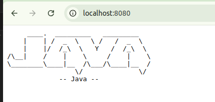

# Docker Training

## The need for Docker

- Docker là gì ?!
- Lí do cần Docker ?!
- Cài đặt Docker như thế nào ?!
- .....

## Chạy ứng dụng bên trong Docker Container

- Không quan trọng ngôn ngữ là gì, một khi chúng ta đã có hiểu biết về Docker, tất cả đều giống nhau.

### Chạy ứng dụng Python bên trong Docker Container

- Trong ví dụ đầu tiên, chúng ta sẽ thử chạy 1 ứng dụng Python đơn giản bên trong Docker Container.


- Hiện tại tôi muốn gắn thư mục python hiện tại vào thư mục `/app` bên trong Docker Container, và chạy ứng dụng Python này.

- Chúng ta sẽ sử dụng câu lệnh `docker run` sau đó chạy sử dụng cờ `-v` (viết tắt của `--volume`) để gắn thư mục hiện tại vào thư mục `/app` bên trong Docker Container.
- Bên trong docker container, để chúng ta có thể chạy ứng dụng Python, chúng ta cần phải cài đặt môi trường Python trước

- Chúng ta sẽ sử dụng 1 image có sẵn trên Hub đó là `python:3.8-slim` để chạy ứng dụng Python này.

- Giả sử chúng ta không biết gì về Python, làm gì để chúng ta có thể chạy ứng dụng Python này bên trong Docker Container?

``` text
# Developer: Hey there, Captain DevOps! To run this application without Docker, simply execute:
#            python python-app.py
#            I trust that you can take it from here and work your container magic. Smooth sailing!
```

```bash
docker run -v <local_path>:<container_path> <image_name>
```

```bash
docker run -v "D:\SeniorProject2025\docker-kube-tranning\docker-tranning\run-application-inside-docker-container\python:/app/" python:3.8-slim python /app/python-app.py
```

- Chúng ta sẽ sử dụng câu lệnh `docker run` để chạy ứng dụng Python này bên trong Docker Container.

- Lệnh này bằng lệnh `docker create` + `docker start`

- Chúng ta sẽ sử dụng cờ `-v` để gắn thư mục hiện tại vào thư mục `/app` bên trong Docker Container.
- Chúng ta sẽ sử dụng image `python:3.8-slim` để chạy ứng dụng Python này.
- Chúng ta sẽ sử dụng câu lệnh `python /app/python-app.py` để chạy ứng dụng Python này bên trong Docker Container. bên trong Docker Container.


- Bạn cũng có thể đặt tên cho container của mình bằng cách sử dụng cờ `--name` và thêm cờ `--rm` để tự động xóa container khi nó dừng lại.

```bash
docker run --name my-python-app --rm -v "D:\SeniorProject2025\docker-kube-tranning\docker-tranning\run-application-inside-docker-container\python:/app/" python:3.8-slim python /app/python-app.py
```

- Nên đặt tên cho container của bạn để dễ dàng quản lý và theo dõi.

- Xóa image bằng câu lệnh:

```bash
docker rmi python:3.8-slim
docker image rm python:3.8-slim
```

### Chạy ứng dụng Java bên trong Docker Container

- Trong ví dụ tiếp theo, chúng ta sẽ thử chạy 1 ứng dụng Java đơn giản bên trong Docker Container.


- Hướng dẫn:

```text
Developer: Greetings, Captain DevOps! This application is usually executed with the command:
           java -cp JavaApp.jar JavaApp
           However, I have full confidence in your abilities to containerize it and unleash its full potential. Fair winds and following seas!

```

```bash
docker run -v "D:\SeniorProject2025\docker-kube-tranning\docker-tranning\run-application-inside-docker-container\java:/app/" openjdk:11 java -cp /app/JavaApp.jar JavaApp
```

- Kết quả:


- Có thể dùng ChatGPT để convert các câu lệnh để chạy trên Windows sang Linux hoặc ngược lại.

### Chạy ứng dụng Ruby bên trong Docker Container

- Hướng dẫn:

```text
# Developer: Captain DevOps, this Ruby script generates a random inspirational quote and prints it along with an ASCII art border.
#            To run this script, you would typically use the command:
#            ruby script.rb
#            I trust you'll navigate the execution of this script within a Docker container with ease!
```

```bash
docker run -v "D:\SeniorProject2025\docker-kube-tranning\docker-tranning\run-application-inside-docker-container\ruby:/app/" ruby:3.0 ruby /app/script.rb
```

- Kết quả:


### Chạy ứng dụng Golang bên trong Docker Container

- Hướng dẫn:

```text
// Developer: Captain DevOps, this app expects an environment variable named "MESSAGE" to customize the greeting.
//            If "MESSAGE" is not set, it defaults to "Hello, World!".
//            To run the app, navigate to the directory containing main.go and execute: go run main.go
//            I trust you'll handle the environment setup and deployment with ease!


// PS:        Environment variables are key-value pairs that are typically set outside the application, and accessed inside the application.
```

```bash
docker run -e MESSAGE="Hello, Docker!" -v "D:\SeniorProject2025\docker-kube-tranning\docker-tranning\run-application-inside-docker-container\go:/app/" golang:1.20 go run /app/main.go
```

- Giải thích:
- Chúng ta sẽ sử dụng cờ `-e` để thiết lập biến môi trường
- Chúng ta sẽ sử dụng cờ `-v` để gắn thư mục hiện tại vào thư mục `/app` bên trong Docker Container.
- Chúng ta sẽ sử dụng image `golang:1.20` để chạy ứng dụng Go này.
- Chúng ta sẽ sử dụng câu lệnh `go run /app/main.go` để chạy ứng dụng Go này bên trong Docker Container.

- Kết quả:


## Building Docker Images From Dockerfile

### Giới thiệu về Dockerfile

- Dockerfile là một tập tin văn bản chứa các lệnh để xây dựng một Docker image.
- Dockerfile cho phép bạn tự động hóa quá trình tạo Docker image, giúp tái sửng và chia sẻ ứng dụng dễ dàng hơn.
- Dockerfile bao gồm các chỉ thị để cài đặt phần mềm, sao chép tệp tin, thiết lập biến môi trường và chạy lệnh khi container được khởi động.


### Cấu trúc cơ bản của Dockerfile

- Một Dockerfile thường bao gồm các chỉ thị sau:
  - `FROM`: Chỉ định image cơ sở để xây dựng.
  - `RUN`: Chạy lệnh trong quá trình xây dựng image.
  - `COPY` hoặc `ADD`: Sao chép tệp tin từ máy chủ vào image.
  - `CMD` hoặc `ENTRYPOINT`: Chỉ định lệnh sẽ chạy khi container khởi động.
  - `EXPOSE`: Mở cổng để giao tiếp với container.

- Để build image từ Dockerfile, chúng ta sử dụng lệnh `docker build`:

```bash
docker build -t <image_name> .

# docker build -t python-app .
# docker build -t python-app:1.0.0 . (Thêm tag cho image khi code có nhiều version)
# docker build -t python-app:latest . (Thêm tag cho image khi code có nhiều version)
# Dấu `.` có nghĩa là thư mục hiện tại
```

- Sau khi build xong, chúng ta có thể thấy image này trong danh sách các image đang có trên local bằng lệnh `docker images` hoặc `docker image ls
`
- Sau khi build xong, chúng ta có thể chạy image này bằng lệnh `docker run <image_name>` hoặc chúng ta có thể đặt tên cho container name bằng cách sử dụng `--name <container_name>`. Nếu ko đặt tên thì docker sẽ tự động tạo ra 1 cái tên cho container này.

```bash
docker run -d --name python-app-container python-app
```

- Cờ `-d` sẽ chạy container ở chế độ nền (detached mode), nếu không có cờ này thì container sẽ chạy ở chế độ foreground và bạn sẽ thấy log của ứng dụng trong terminal.

- Lệnh `-it` là viết tắt của `--interactive` và `--tty`, nó cho phép chúng ta tương tác với container thông qua terminal


- Lệnh `--rm` là viết tắt của `--remove`, nó sẽ tự động xóa container khi container dừng lại
- Để xóa tất cả các container đã dừng lại, chúng ta sử dụng lệnh `prune`:

```bash
docker container prune
docker system prune -a
```

- Dấu `.` trong lệnh `COPY` có nghĩa là thư mục hiện tại. Không nên sử dụng `COPY ..` vì nó sẽ copy tất cả các file trong thư mục cha vào trong container. Sử dụng file `.dockerignore` để loại bỏ các file không cần thiết khi build image.

### Chạy ứng dụng Ruby từ Dockerfile

- Trong ví dụ này, chúng ta sẽ tạo một Dockerfile để chạy ứng dụng Ruby.

```Dockerfile
# Dockerfile for Ruby Application
## 1. Which base image do you want to use?

FROM ruby:3.1

## 2. Set the working directory.
WORKDIR /app

## 3. Copy your source code file to the working directory.
COPY script.rb .
## 4. Define the command to run when the container starts.
CMD ["ruby", "script.rb"]
```

- Lưu Dockerfile này vào thư mục `ruby` trong dự án của bạn.

- Chạy lệnh sau để xây dựng Docker image từ Dockerfile( CHỖ NÀY CẦN PHẢI THAY ĐỔI ĐƯỜNG DẪN TỚI THƯ MỤC CHỨA DOCKERFILE CỦA BẠN):

```bash
docker build -t ruby-app .
```


- Sau khi xây dựng thành công, bạn có thể chạy ứng dụng Ruby bằng lệnh sau:

```bash
docker run --rm --name ruby-app-container ruby-app
```

- Lệnh này sẽ chạy container từ image `ruby-app` và tự động xóa container khi nó dừng lại.


### Chạy ứng dụng Python từ Dockerfile

- Tương tự, chúng ta sẽ tạo một Dockerfile để chạy ứng dụng Python.

```Dockerfile
# Dockerfile for Python Application
## 1. Which base image do you want to use?

FROM python:3.9

## 2. Set the working directory.
WORKDIR /app

## 3. Copy your source code file to the working directory.
COPY python-app.py .

## 4. Define the command to run when the container starts.
CMD ["python", "python-app.py"]
```

- Lưu Dockerfile này vào thư mục `python` trong dự án của bạn.
- Chạy lệnh sau để xây dựng Docker image từ Dockerfile( CHỖ NÀY CẦN PHẢI THAY ĐỔI ĐƯỜNG DẪN TỚI THƯ MỤC CHỨA DOCKERFILE CỦA BẠN):

```bash
docker build -t python-app .
```


- Sau khi xây dựng thành công, bạn có thể chạy ứng dụng Python bằng lệnh sau:

```bash
docker run --rm --name python-app-container python-app
```


### Tương tự, bạn có thể tạo Dockerfile cho các ứng dụng Java, Go, và các ngôn ngữ khác

- Chỉ cần thay đổi phần `FROM`, `COPY`, và `CMD` cho phù hợp với ngôn ngữ và ứng dụng của bạn.


## Containerizing a Web Application

- Trong phần này, chúng ta sẽ tìm hiểu cách container hóa một ứng dụng web đơn giản bằng Flask, một framework Python phổ biến.
- Chúng ta sẽ tạo một Dockerfile để xây dựng một Docker image cho ứng dụng Flask này.

- `Ngữ cảnh:` Có 1 anh em nào đó đưa cho bạn 1 con web bằng Java(hoặc bất kì ngôn ngữa nào), nó bảo là chạy trên máy nó được với các dependencies này kia. Bây giờ nó muốn bạn chạy trên máy bạn, nhưng mà bạn không biết nó chạy như thế nào.

### Web app Flask

```Dockerfile
## 1. Which base image do you want to use?

FROM python:3.9-slim
## 2. Set the working directory
WORKDIR /app/

## 3. Copy the project files into the working directory.
COPY . . 

## 4. Install the dependencies
RUN pip install -r flask-app-demo/requirements.txt

## 5. Document and inform the developer that the application will use PORT 5000 of the container.
EXPOSE 5000

## 6. Define the command to run when the container starts.

CMD ["python", "flask-app-demo/app.py"]
```

- Lưu Dockerfile này vào thư mục `flask` trong dự án của bạn. Giải thích các dòng trong Dockerfile:
- `FROM python:3.9-slim`: Sử dụng image Python 3.
- `WORKDIR /app/`: Thiết lập thư mục làm việc bên trong container.
- `COPY . .`: Sao chép tất cả các tệp từ thư mục hiện tại vào thư mục làm việc trong container.
- `RUN pip install -r requirements.txt`: Cài đặt các phụ thuộc từ tệp `requirements.txt`.
- `EXPOSE 5000`: Mở cổng 5000 để ứng dụng Flask có thể lắng nghe.
- `CMD ["python", "flask-app-demo/app.py"]`: Định nghĩa lệnh sẽ chạy khi container khởi động.

- Chạy lệnh sau để xây dựng Docker image từ Dockerfile( CHỖ NÀY CẦN PHẢI THAY ĐỔI ĐƯỜNG DẪN TỚI THƯ MỤC CHỨA DOCKERFILE CỦA BẠN):

```bash
docker build -t flask-app .
```


- Sau khi xây dựng thành công, bạn có thể chạy ứng dụng Flask bằng lệnh sau:

```bash
docker run --rm --name flask-app-container -p 5000:5000 flask-app
```

Giải thích các cờ:

- `--rm`: Tự động xóa container khi nó dừng lại.
- `--name flask-app-container`: Đặt tên cho container để dễ quản lý.
- `-p 5000:5000`: Chuyển tiếp cổng 5000 từ máy chủ đến cổng 5000 trong container.

- Kết quả:


- Bạn có thể dùng trình duyệt để truy cập ứng dụng Flask tại địa chỉ `http://localhost:5000`.

- Bạn cũng có thể tương tác với docker container đang chạy bằng cách sử dụng lệnh `docker exec`:

```bash
docker exec -it flask-app-container /bin/bash
```

- Lệnh này sẽ mở một terminal bên trong container, cho phép bạn thực hiện các lệnh trực tiếp trong môi trường của ứng dụng Flask.

- Bạn cũng có thể thay đổi cách khai báo theo thứ tự khác nhau miễn là cung cấp đủ các chỉ thị cần thiết. Ví dụ, bạn có thể đặt `EXPOSE` trước `CMD` hoặc `RUN` trước `COPY`, miễn là các chỉ thị vẫn được thực hiện đúng thứ tự.

- Bạn có thể thêm các chỉ thị khác như `ENV` để thiết lập biến môi trường hoặc `VOLUME` để tạo volume cho dữ liệu.

### Web app Java

- Cách 1:


- Cách 2


- Dockerfile cho ứng dụng Java:

```Dockerfile
## 1. Which base image do you want to use?

FROM maven:3.8-openjdk-17-slim

## 2. Set the working directory.

WORKDIR /app

## 3. Copy the application's project files into the working directory.

COPY springboot-demo  /app

# COPY springboot-demo  .

## 4. Document and inform the developer that the application will use the container port: 8080.

EXPOSE 8080

## 5. Define the command to run when the container starts.

CMD ["mvn", "clean", "spring-boot:run"]
```

- Lưu Dockerfile này vào thư mục `java` trong dự án của bạn.

- Chạy lệnh sau để xây dựng Docker image từ Dockerfile( CHỖ NÀY CẦN PHẢI THAY ĐỔI ĐƯỜNG DẪN TỚI THƯ MỤC CHỨA DOCKERFILE CỦA BẠN):

```bash
docker build -t springboot-demo .
```

- Sau khi xây dựng thành công, bạn có thể chạy ứng dụng Java bằng lệnh sau:

```bash
docker run -p 8080:8080 --rm --name springboot-demo-container  springboot-demo
```

- Kết quả:



## Docker network and Microservices

- Trong phần này, chúng ta sẽ tìm hiểu về Docker network và cách sử dụng nó để kết nối các container trong một ứng dụng microservices.
- Docker network cho phép các container giao tiếp với nhau thông qua các địa chỉ IP và tên miền.
- Tạo một mạng Docker để kết nối các container:

```bash
docker network create my-network
```

- Lệnh này sẽ tạo một mạng Docker mới có tên `my-network`.
- Chúng ta sẽ sử dụng mạng này để kết nối các container trong ứng dụng microservices của mình.

```bash
docker run --rm --name service1 --network my-network service1-image
docker run --rm --name service2 --network my-network service2-image
docker run --rm --name service3 --network my-network service3-image
```

- Các lệnh này sẽ chạy các container `service1`, `service2`, và `service3` trên mạng `my-network`.
- Bạn có thể sử dụng tên container để giao tiếp giữa các dịch vụ. Ví dụ, nếu `service1` cần gọi `service2`, nó có thể sử dụng địa chỉ `http://service2:port`.
- Bạn có thể kiểm tra các mạng Docker hiện có bằng lệnh:

```bash
docker network ls
```

- Để xem thông tin chi tiết về một mạng cụ thể, bạn có thể sử dụng lệnh:

```bash
docker network inspect my-network
```
